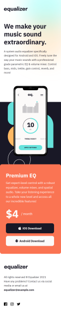
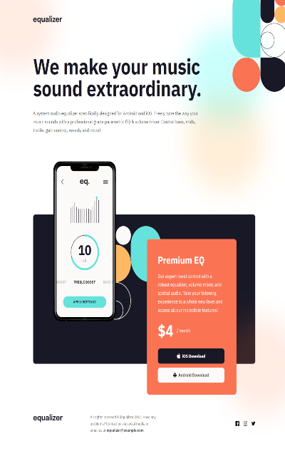

## Jump To

- [Screenshots](#screenshots)
- [Links](#links)
- [Notes](#notes)
  - [Built with](#built-with)
- [Author](#author)

### Screenshots

### Links

- GitHub Repo: [Go to Repository](https://github.com/gkhuskivadze/Equalizer-LandingPage-Markup)
- Live Demo: [Go to Demo](https://gkhuskivadze.github.io/Equalizer-LandingPage-Markup)

### Built with

- Semantic HTML5
- CSS Flexbox
- CSS Media Queries

### Notes

- Markup is made for three screen resolutions 375, 768px, 1440px.
- Fonts are linked from Google Fonts service.
- REM size is 10px and set to html using font-size property set by %.
- This project gave me ability to play with absolute positioning on three different layouts, it does give good practice option to better understand which centering and styling properties work with and suit each other well and in what kind of situations.
- There is at first glance simple task to position visual image patterns on background but it required good attention to detail(simply using Background properties rule accordingly) to make them work responsively.
- I have gained a little more knowledge how to visually style SVG file extension for front-end side.
- I increased understanding of CSS inheritance and wrote property rules for elements more efficiently, compactly and clear.

## Author

- LinkedIn - [Giorgi Khuskivadze](https://www.linkedin.com/in/gkhuskivadze)
- GitHub - [Giorgi Khuskivadze](https://github.com/gkhuskivadze)
